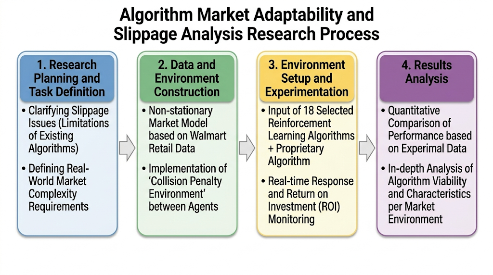

# Comparative Analysis of Adaptive MARL Strategies in Non-Stationary Financial Markets

> **Official Repository for the paper:** *"비정상성 금융 시장 내 다중 에이전트 강화학습 전략 적응성 비교 연구"*

## Description
This project is a comprehensive Multi-Agent Reinforcement Learning (MARL) testbed designed to analyze the "Density Paradox" - the phenomenon where multiple AI agents compete for limited resources in a highly volatile, non-stationary financial/retail market. It aims to identify the most robust survival and profit-maximizing strategies in overcrowded environments.

### Key Features
- Dynamic Market Modeling: Simulates 4 distinct market regimes - Stationary, Shock, Trend and Regime Switch - using real-world Walmart retail data (M5 Dataset).
- Slippage Penalty: Implements a non-linear penalty for overcrowded assets to replicate real-world "Market Impact" and penalize irrational "Herd Behavior".
- Algorithm Battle Royale: A massive competitive ecosystem featuring over 57 different RL algorithms, ranging from human-like heuristics and classical statistics to complex RL algorithms.
- TrueSkill Evaluation: Introduces an objective, relative rating system based on TrueSkill to evaluate the true strategic robustness of agents amidst severe market noise.

## Research Framework



Our research follows a systematic 4-phase approach to analyze algorithm performance in non-stationary market environments with collision penalties.

## Conclusion

### Summary of Experimental Results
- **Derivation of the Best Algorithm**: Experimental results showed that the exponential decay-based **Decaying Epsilon-Greedy** algorithm achieved the best performance, recording the highest TrueSkill Score (≈89.7) and a top 30% survival rate (≈79.6%).
- **Demonstration of Strategic Robustness**: This suggests that in environments with extreme uncertainty, bold initial exploration and an adaptive exploration-exploitation transition mechanism are more effective in securing strategic robustness than complex pattern learning or fixed heuristics.

### Project Significance
- **Strategy Verification in a Complex Non-stationary Market**: This study established a complex non-stationary market environment based on real retail data, where regime switches and slippage penalties coexist, and empirically verified the adaptability and survivability of multi-agent reinforcement learning strategies.
- **Introduction of a Relative Evaluation Framework**: To overcome the limitations of absolute profit metrics, this study introduced a relative evaluation framework based on TrueSkill to compare the practical superiority among agents amidst market noise.

### Future Research Plans
- **Integration with Advanced Learning Models**: It is expected that by enhancing the capability to respond to non-stationarity through future integration with deep learning and meta-learning, more advanced multi-agent decision-making outcomes can be generated.


## Repository Structure and Code Description

This repository is organized to support the full experimental pipeline of our project: simulating a non-stationary multi-agent market environment, implementing bandit-based reinforcement learning agents, evaluating their relative performance, and visualizing the final results.

The structure of the codebase directly reflects the research goal of this project. Since real-world financial and retail markets are non-stationary, agents must continuously adapt to changing reward patterns, market shocks, and competitive pressure from other agents. In addition, when many agents choose the same arm at the same time, crowding effects and slippage-like penalties can reduce the final reward. Therefore, this repository is designed not only to compare individual reward-maximizing strategies, but also to analyze each agent’s robustness and survival ability in a competitive multi-agent setting.

```text
2026-HAI-MARL/
├── agents/                # Bandit and reinforcement learning agent implementations
├── arms/                  # Market arm definitions and non-stationary reward dynamics
├── data/walmart/          # Walmart data preprocessing and feature extraction scripts
├── docs/                  # Project documentation and figures
├── envs/                  # Custom multi-agent simulation and evaluation environment
├── output/                # Generated experiment results, CSV files, and figures
├── utils/                 # Utility modules for logging, plotting, and figure generation
├── main.py                # Entry point for generating paper-level visualizations
├── trueskill_qualifier.py # TrueSkill-based multi-agent tournament evaluation script
└── environment.yml        # Conda environment configuration
```

---

### `agents/`: Agent Strategy Implementations

The `agents/` directory contains the core decision-making algorithms used in the experiment. These agents represent different exploration-exploitation strategies for multi-armed bandit and reinforcement learning settings.

This directory includes classic baseline algorithms such as UCB, Epsilon-Greedy, Softmax, Thompson Sampling, and WSLS, as well as adaptive variants designed for non-stationary environments. Important adaptive agents include Decaying Epsilon-Greedy, Sliding Window UCB, Periodic UCB, FFT-UCB, and Thompson Collision-Aware.

These implementations are central to the project because the experiment compares how different agents respond to changing market conditions and multi-agent competition. For example, Decaying Epsilon-Greedy gradually reduces exploration over time, while Thompson Collision-Aware considers collision effects caused by multiple agents selecting the same arm.


---

### `arms/`: Non-Stationary Market Arm Definitions

The `arms/` directory defines the reward-generating arms used in the simulation. Each arm can be interpreted as a selectable asset, product category, or market opportunity.

Unlike a stationary bandit environment, this project models a market where reward distributions can change over time. The arm modules represent different types of market behavior, such as stationary rewards, long-term trends, sudden event shocks, and regime-switching patterns.

This part of the repository is directly connected to the project’s main problem setting: agents cannot simply memorize one optimal arm because the reward structure changes dynamically. As a result, the agents must continuously balance exploration and exploitation while adapting to non-stationary market dynamics.

---

### `data/walmart/`: Walmart Data Processing

The `data/walmart/` directory contains scripts for preprocessing Walmart sales data and transforming it into a format that can be used in the simulation environment.

This data processing step is important because the project aims to evaluate agents in a market environment that reflects real-world retail patterns rather than relying only on fully synthetic rewards. By using Walmart sales data, the simulation can include realistic demand changes, trend patterns, and irregular fluctuations.

The processed data provides the foundation for constructing the non-stationary market environment used in the experiments.

---

### `envs/`: Multi-Agent Simulation Environment

The `envs/` directory contains the custom environment and evaluator used to run the multi-agent simulation.

This module connects agents, arms, rewards, and competitive interactions. At each time step, multiple agents choose arms simultaneously, and the environment calculates the resulting rewards. Because several agents may select the same arm, the environment can reflect crowding effects and slippage-like reward degradation.

This design allows the project to model a more realistic competitive market setting. Instead of evaluating agents in isolation, the environment tests whether each strategy can survive under both non-stationary reward dynamics and competition from other agents.

---

### `utils/`: Logging, Analysis, and Visualization Utilities

The `utils/` directory contains supporting modules for experiment logging, result aggregation, and visualization. These files do not define the agents themselves. Instead, they help convert raw simulation outputs into interpretable results and figures.

Key utility files include:

| File | Main Role |
|---|---|
| `mc_logger.py` | Records Monte Carlo simulation results, saves agent-level reward/action logs, and creates summary scorecards. |
| `plot_results.py` | Visualizes the results of a single experiment run, including cumulative rewards, moving averages, collision trends, and agent-level action patterns. |
| `plot_batch_results.py` | Generates aggregate comparison graphs from Monte Carlo results, including reward distributions, win rates, Top 30% entry rates, risk-return plots, learning curves, and radar charts. |
| `plot_paper_figures.py` | Creates paper-ready conceptual figures for market dynamics, slippage penalty, and representative episode trajectories. |
| `generate_figure.py` | Runs the figure-generation pipeline using saved experiment outputs and produces figures for analysis and reporting. |

The `utils/` modules are important because this project evaluates agents from multiple perspectives. The analysis does not rely only on cumulative reward. It also considers risk, win rate, Top 30% survival rate, collision behavior, and learning dynamics. This supports the project’s focus on strategic robustness in noisy and competitive non-stationary environments.

---

### `trueskill_qualifier.py`: TrueSkill-Based Relative Evaluation

`trueskill_qualifier.py` is the main evaluation script for comparing agents through repeated multi-agent tournaments.

This script generates a candidate pool of agent variants, randomly selects groups of agents for each match, runs simulations in the dynamic market environment, and updates each agent’s rating using the TrueSkill system. The final leaderboard is saved as a CSV file in the `output/` directory.

This evaluation method is closely connected to the goal of the project. In a highly noisy and non-stationary market, absolute cumulative reward can be affected by random market conditions. Therefore, the TrueSkill-based framework provides a relative performance measure that compares agents based on their rankings across many competitive matches.

The final results help identify which strategies are not only profitable, but also consistently robust against market changes, slippage, and competition.

---

### `output/`: Experiment Results and Figures

The `output/` directory stores generated experiment artifacts. These include leaderboard CSV files, raw simulation logs, agent-level reward and action histories, summary scorecards, and visualization results.

These outputs are used to analyze agent performance in terms of profitability, stability, survival, and robustness. They also provide the figures and tables used to support the final experimental conclusion of the project.

---

## Overall Code Flow

The overall experiment pipeline can be summarized as follows:

```text
Walmart sales data
        ↓
Data preprocessing
        ↓
Non-stationary market arm construction
        ↓
Multi-agent simulation environment
        ↓
Agent strategy competition
        ↓
Monte Carlo logging and TrueSkill evaluation
        ↓
Result visualization and performance analysis
```

Through this pipeline, the repository connects the project’s theoretical problem — non-stationary market adaptation, density paradox, and slippage under multi-agent competition — with the final empirical comparison of MARL and bandit-based strategies.
