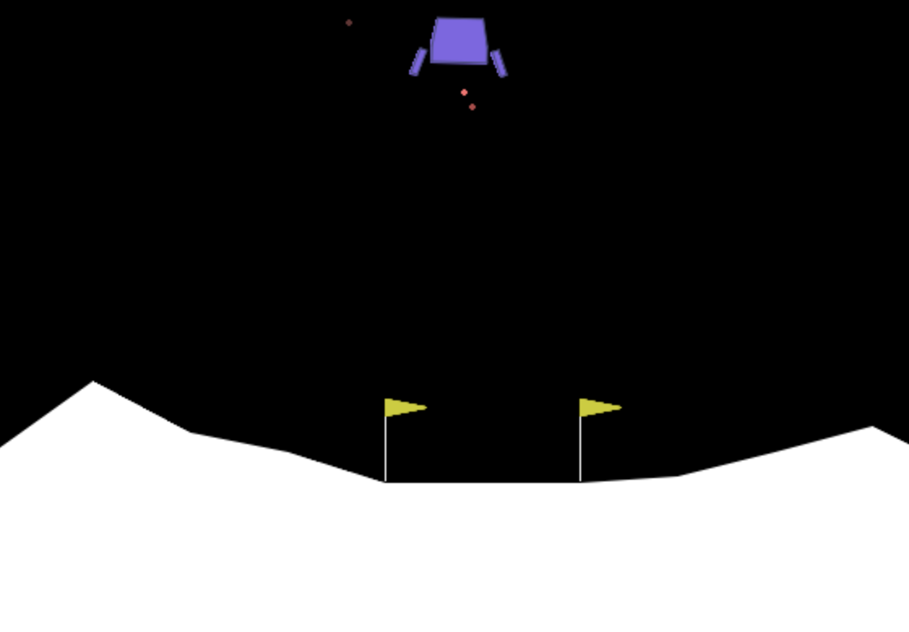

# 20260321 작업 일지

## 3주차 세미나 준비

### OpenAI Gym 설치

```bash
conda create -f environment.yml
conda activate HAI261
conda install -c conda-forge gym
conda install -c conda-forge pybox2d pyglet
pip install shimmy
```

### DQN 구현

```bash
python main.py
```

# DQN 실습 세미나 발표 자료

---

## 목표

- Experience Replay 구현 이해
- Q-network / Target Network 분리 이해
- 파라미터 업데이트 과정 이해

---

## 학습 중 주요 지표

- `ep_rew_mean` → 학습이 잘 되고 있는지 핵심 지표
- `exploration_rate` → ε-greedy의 입실론 값 (1.0 → 0.05 감소)

---

## 코드 구조 (main.py)

| 단계 | 내용 |
|------|------|
| 1단계 | 환경 생성 (`gym.make`) |
| 2단계 | DQN으로 정책 학습 (`MlpPolicy`) |
| 3단계 | 모델 평가 (`predict` + `render`) |

---

## 강화학습 기초 개념 (쉽게 이해하기)

강화학습을 이해하기 위한 5가지 필수 요소입니다:

1. **Agent (에이전트)**: 학습하고 행동하는 주체 (예: 게임 캐릭터, 인공지능)
2. **Environment (환경)**: 에이전트가 활동하는 세상 (예: 게임 맵, 시뮬레이터)
3. **State (상태)**: 현재 환경이나 에이전트의 상황 (예: 캐릭터의 현재 위치와 화면 픽셀)
4. **Action (행동)**: 에이전트가 취할 수 있는 움직임 (예: 상/하/좌/우 이동)
5. **Reward (보상)**: 행동에 따른 결과로 주어지는 점수. (예: 점수 획득 시 +, 장애물 충돌 시 -)

> **목표:** 에이전트는 환경 속에서 수많은 시도를 반복하며, 최종적으로 누적 보상(Reward)을 가장 많이 받을 수 있는 최적의 행동 규칙(Policy)을 찾아내는 것입니다.

---

## Q-Learning이란?

강화학습의 대표적인 고전 알고리즘입니다.

- **Q-Value (Q값)**: 특정 '상태(State)'에서 특정 '행동(Action)'을 취했을 때, 미래에 얻을 것으로 기대되는 **총 보상의 가치**입니다.
- **Q-Table (Q 테이블)**: 모든 가능한 상태와 행동에 대한 Q값을 기록해두는 거대한 엑셀 표(Table)라고 생각하면 쉽습니다. 에이전트는 이 표를 보고 가장 가치(Q값)가 높은 행동을 선택합니다.

**Q-Table의 한계점:**
틱택토(Tic-Tac-Toe)처럼 상태가 적은 게임은 표를 만들 수 있습니다. 하지만 아타리(Atari) 게임이나 자율주행처럼 화면의 픽셀이 무수히 많은 경우, 모든 상태를 표에 저장하려 하면 메모리가 부족하여 학습이 불가능해집니다.

---

## 딥러닝과의 결합: DQN (Deep Q-Network)의 탄생

이러한 상태 공간의 폭발(State Space Explosion) 문제를 해결하기 위해, 표(Table) 대신 **인공지능 신경망(Neural Network)**을 도입했습니다.

- 수많은 상태(State, 이미지 픽셀 전체 등)를 인공신경망의 입력으로 직접 넣고, 신경망이 각 행동(Action)별 Q값을 유추하여 출력하게 만듭니다.
- 이렇게 **Q-Learning에 딥러닝(Deep Learning)을 결합한 알고리즘을 딥 큐 네트워크(Deep Q-Network, DQN)라고 부릅니다.**

---

## DQN 핵심 전략 2가지

하지만 신경망을 그대로 강화학습에 붙이면 너무 불안정해서 학습이 잘 되지 않았습니다. 이를 획기적으로 해결한 두 가지 천재적인 핵심 기법이 바로 DQN의 핵심입니다.

**① Experience Replay (경험 재생)**
> 에이전트가 환경과 상호작용하며 얻은 경험 데이터들(상태, 행동, 보상, 다음 상태)을 Replay Buffer라는 메모리에 모두 쌓아둡니다.
> 학습할 때는 가장 최근 경험을 배우는 것이 아니라, 메모리에서 **랜덤하게 미니배치(예: 100개)를 뽑아와서 학습**합니다. 이렇게 하면 데이터 샘플 간의 상관관계를 끊어주어 치우치지 않고 안정적으로 학습할 수 있습니다.

**② Target Network 분리 (목표망 분리)**
> 학습하면서 목표(Target Q)가 되는 정답지도 덩달아 휙휙 변하면 에이전트가 우왕좌왕하게 됩니다.
> 그래서 실시간으로 학습하는 **Q-network**와, 정답치 계산 목적으로만 쓰며 아주 가끔씩만 업데이트되는 **Target network**를 별도로 두어 학습의 흔들림을 방지합니다.

---

## 🔄 코드와 함께 보는 학습 루프 (dqn.py 핵심 흐름)

실제 세미나 코드(`dqn.py`의 `train` 함수)에서 위 개념들이 어떻게 구현되어 있는지 단계별로 살펴보겠습니다.

### 1. Experience Replay (경험 재생)

```python
# Replay Buffer에서 100개(batch_size)의 과거 기억을 무작위로 뽑아옵니다.
replay_data = self.replay_buffer.sample(batch_size, env=self._vec_normalize_env)
```

> 💡 **해설:** 에이전트가 그동안 겪었던 `(현재 상태, 행동, 보상, 다음 상태)`의 세트들을 메모리에서 랜덤하게 꺼냅니다.

### 2. Target Network로 미래 가치 예측

```python
with th.no_grad():
    # Target 네트워크를 통해 '다음 상태'에서의 Q값들을 예측합니다.
    next_q_values = self.q_net_target(replay_data.next_observations)
    
    # 그 중 가장 높은(max) 가치를 가진 행동의 Q값을 선택합니다.
    next_q_values, _ = next_q_values.max(dim=1)
```

> 💡 **해설:** "내가 다음 상태로 넘어갔을 때, 거기서 가장 좋은 행동을 하면 점수를 얼마나 얻을까?"를 안정적인 Target Network에게 물어봅니다.

### 3. 정답지(TD Target) 만들기

```python
# 정답지 = 현재 받은 보상 + (아직 게임이 안 끝났다면) 할인율 * 미래 가치
target_q_values = replay_data.rewards + (1 - replay_data.dones) * self.gamma * next_q_values
```

> 💡 **해설:** 인공지능이 맞춰야 할 '정답지'를 만듭니다. 만약 게임이 끝났다면(`dones == 1`) 미래 가치는 0이 되고, 순수하게 방금 받은 보상만 남습니다.

### 4. 현재 상황에 대한 예측값(Q-network) 뽑기

```python
# 현재 네트워크에게 '현재 상태'의 모든 행동에 대한 Q값들을 물어봅니다.
current_q_values = self.q_net(replay_data.observations)

# 그 중에서 에이전트가 실제로 했던 '행동(action)'에 대한 예측값만 쏙 골라냅니다.
current_q_values = th.gather(current_q_values, dim=1, index=replay_data.actions.long())
```

> 💡 **해설:** 에이전트의 현재 뇌(Q-network)가 당시에 추측했던 내 행동의 가치를 가져옵니다.

### 5. 오차 계산 및 학습 (역전파)

```python
# 정답지(target)와 내 추측(current) 사이의 차이(Loss)를 계산합니다. (Huber Loss 사용)
loss = F.smooth_l1_loss(current_q_values, target_q_values)

# 오차를 줄이는 방향으로 뇌(신경망 가중치)를 업데이트합니다.
self.policy.optimizer.zero_grad()
loss.backward()
self.policy.optimizer.step()
```

> 💡 **해설:** 정답 대비 내가 얼마나 틀렸는지(Loss) 계산한 값을 바탕으로, 다음에는 덜 틀리도록 네트워크를 학습시킵니다!

---

## 정리

> **DQN = Q-learning + Deep Learning + Experience Replay + Target Network**

단순한 Q러닝에 딥러닝을 얹고, 경험 재생과 목표망 분리라는 놀라운 아이디어를 더해 탄생한 DQN은 딥러닝 기반 강화학습(Deep RL)에 큰 혁신을 가져왔습니다.

## 시각화

학습 과정 시각화


달착륙 시뮬레이션 시각화

